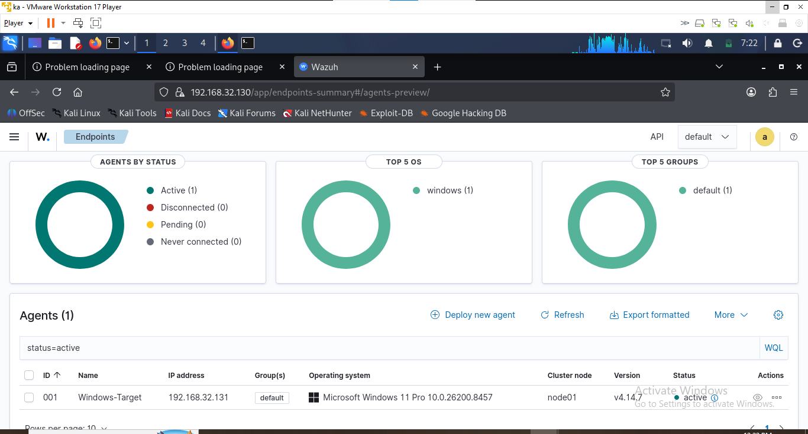
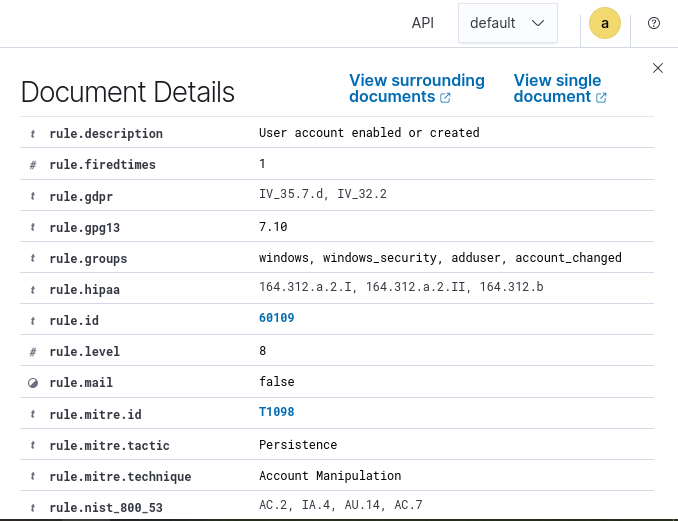
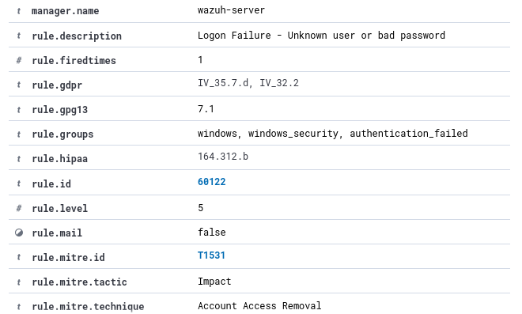

# wazuh-soc-detection-lab
Hands-on SOC/SIEM lab using Wazuh for Windows security monitoring, detection, MITRE ATT&amp;CK mapping, alert investigation, and event correlation.


# Wazuh SOC Detection & Investigation Lab

Hands-on SOC/SIEM project focused on Windows security monitoring, detection engineering, MITRE ATT&CK mapping, alert investigation, and event correlation using Wazuh.

## Project Overview

I built an isolated SOC monitoring environment using **Wazuh, Windows 11, Kali Linux, Windows Security auditing, PowerShell logging, and Sysmon**.

Rather than stopping at SIEM deployment, the project focused on the complete SOC workflow:

```text
Telemetry Generation
        ↓
Log Collection
        ↓
Detection
        ↓
Alert Validation
        ↓
Investigation
        ↓
Event Correlation
        ↓
Analyst Disposition
```

### Detection Scenarios

Three controlled security scenarios were examined:

1. **Windows Account Creation** — Event ID 4720 → Wazuh Rule 60109 → MITRE ATT&CK T1098
2. **PowerShell & Registry Activity** — Event ID 4104 telemetry with T1059.001 and T1112 context
3. **Failed Authentication** — Event ID 4625 → Wazuh Rule 60122 → full SOC investigation

The failed-authentication alert was correlated with a successful **Event ID 4624 approximately 12 seconds later**, allowing the activity to be classified as likely benign rather than automatically treated as malicious.

## Lab Architecture

| System | Role | IP Address |
|---|---|---|
| Kali Linux | Analyst workstation | `192.168.32.128` |
| Wazuh Manager | SIEM / Indexer / Dashboard | `192.168.32.130` |
| Windows-Target | Monitored endpoint | `192.168.32.131` |

The systems communicated over an isolated VMware Host-only network (`192.168.32.0/24`).

## Tools and Technologies

- Wazuh 4.14.7
- Windows 11 Pro
- Wazuh Windows Agent
- Windows Security Event Logs
- PowerShell Operational Logging
- PowerShell Script Block Logging
- Sysmon 15.21
- Kali Linux
- VMware Workstation 17 Player
- Filebeat
- MITRE ATT&CK

## Skills Demonstrated

- SIEM monitoring and alert validation
- Windows Security event analysis
- Authentication investigation
- Event correlation and timeline analysis
- Alert triage and analyst disposition
- Wazuh Threat Hunting
- MITRE ATT&CK interpretation
- PowerShell telemetry analysis
- Linux and Windows troubleshooting
- SIEM data-pipeline troubleshooting
- Root-cause analysis
- Technical security documentation

## Full Technical Report

For the complete implementation, detection methodology, investigation workflow, troubleshooting process, remediation, verification, and interview talking points, see:

**[View the Full Technical Report](REPORT.md)**

## Evidence

Supporting screenshots from the lab are available in the [`screenshots`](screenshots/) directory.

The evidence includes endpoint integration, Windows telemetry collection, account-creation detection, PowerShell telemetry, failed-authentication detection, MITRE ATT&CK mappings, and SIEM pipeline troubleshooting.

> **Security Notice:** Credentials, passwords, API tokens, and other sensitive authentication information are excluded or redacted from all published documentation and screenshots.


## Featured Evidence

### Windows Endpoint Connected to Wazuh

The Windows 11 endpoint successfully registered with the Wazuh Manager and remained active during the monitoring exercises.



### Account Creation Detection — MITRE ATT&CK T1098

Windows account-management activity triggered Wazuh Rule 60109 (Level 8) and was mapped to **T1098 — Account Manipulation** under the Persistence tactic.



### Failed Authentication Detection — Wazuh Rule 60122

The controlled failed authentication triggered Wazuh Rule 60122 (Level 5). Wazuh's built-in ATT&CK mapping associated the alert with **T1531 — Account Access Removal**.



> **Analyst note:** The T1531 mapping above is Wazuh's built-in rule mapping. Event correlation showed that the controlled failed login was likely benign and consistent with a mistyped password followed by a successful login.
